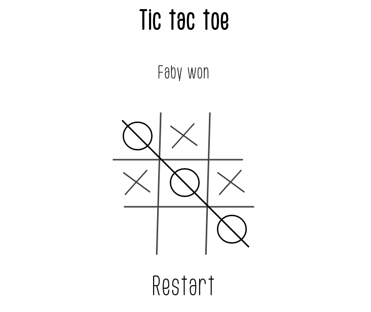

# Tic Tac Toe

  <h3>
    <a href="https://tic-tac-toe-daniel.netlify.app/">
      Demo
    </a>
     | 
    <a href="https://github.com/voromahery/tic-tac-toe">
      Code
    </a>
  </h3>

<!-- TABLE OF CONTENTS -->

## Table of Contents

- [Overview](#overview)
  - [Built With](#built-with)
- [Features](#features)
- [How to use](#how-to-use)
- [Contact](#contact)
- [Acknowledgements](#acknowledgements)

<!-- OVERVIEW -->

## Overview

- Feel free to click this link to see my app [Tic Tac Toe](https://tic-tac-toe-daniel.netlify.app/) :

## [Acknowledgements](#acknowledgements)

Tic Tac Toe is a board game that can be played with 2 people competing against to each other. Each person has a piece whether cross (X) or circle (O). The goal is to get three of your pieces aligned (eg: XXX or OOO), horizontally or vertically or diagonally.

By building this application, I learned to use Redux toolkit and it helped me a lot to be confident with React and typeScript.

## [Built With](#built-with)

- [CSS](https://developer.mozilla.org/en-US/docs/Web/CSS)
- [React](https://reactjs.org/)
- [TypeScript](https://www.typescriptlang.org/)
- [redux toolkit](https://redux-toolkit.js.org/)

## [How to use](#how-to-use)

### Clone this repository

`$ git clone https://github.com/voromahery/tic-tac-toe`

### Install dependencies

`$ npm install`

### Run the app

`$ npm start`

## Contact

- Email: daniel.her@onja.org
- GitHub [voromahery](https://github.com/voromahery)
